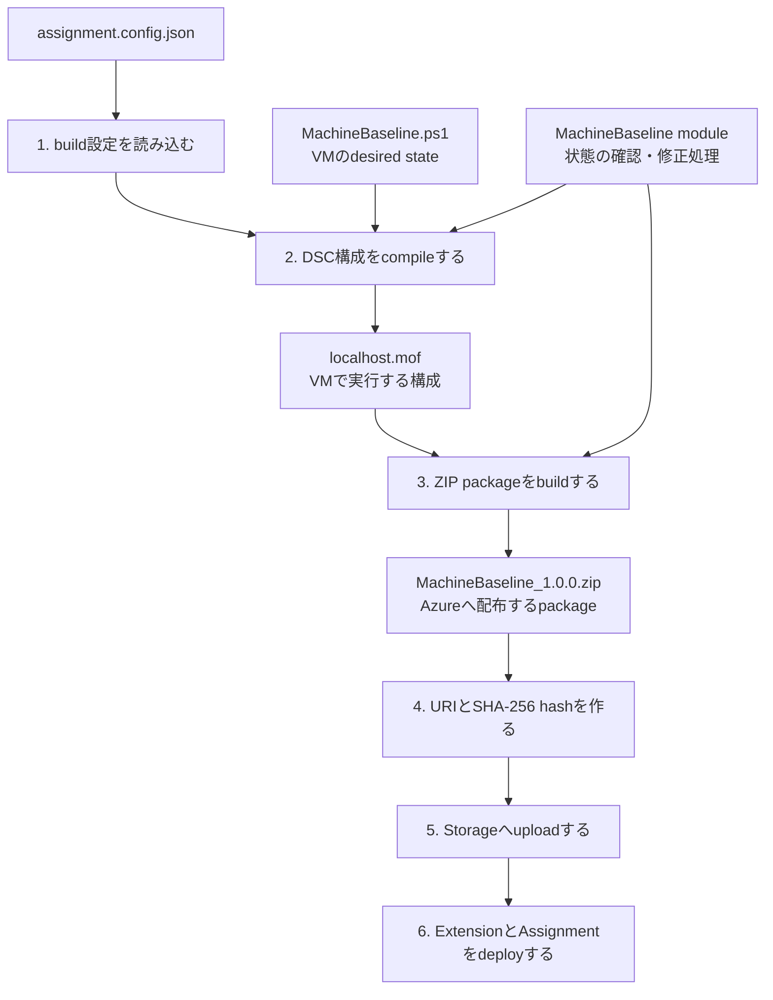

# 直接 Assignment による Machine Configuration 自動適用

`prepare/` で作成済みのUbuntu VMへ、Azure Policyを介さずGuest Configuration ExtensionとGuest Configuration Assignmentを直接デプロイします。`ApplyAndAutoCorrect` による構成適用とドリフトの自動修復を検証できます。

この方式と [../guest_configuration_policy/README.md](../guest_configuration_policy/README.md) のPolicy方式は代替関係です。同じVMへ同じ構成を同時にデプロイしないでください。方式を切り替える場合は、現在の方式をcleanupしてから次の方式をデプロイします。

## 1. 前提条件

- [../prepare/README.md](../prepare/README.md) の手順に従い、Azure基盤のデプロイを完了してください。
- コマンドを実行する端末にPowerShell 7を用意してください。
- Azure PowerShellの `Az.Accounts`、`Az.Resources`、`Az.Compute`、`Az.Storage` モジュールをインストールしてください。
- スタンドアロンのBicep CLIをインストールし、`PATH` に登録してください。
- packageの作成に使用する `GuestConfiguration` PowerShellモジュールをインストールしてください。
- DSC構成のコンパイルに使用する `PSDesiredStateConfiguration` 3.0.0をインストールしてください。
- 対象のResource GroupでVM ExtensionとGuest Configuration Assignmentを作成できる権限を持つアカウントを使用してください。

以下のコマンドで必要なPowerShellモジュールをインストールし、Azureへログインして対象のサブスクリプションを選択します。

```powershell
Install-Module -Name Az -Scope CurrentUser -Repository PSGallery -Force
Install-Module -Name GuestConfiguration -Scope CurrentUser -Force
Install-Module -Name PSDesiredStateConfiguration `
  -RequiredVersion 3.0.0-beta1 `
  -AllowPrerelease `
  -Scope CurrentUser

Connect-AzAccount
Set-AzContext -Subscription '<subscription-id-or-name>'
```

## 2. デプロイ

リポジトリルートでprepare deploymentのoutputsを取得します。

```powershell
$resourceGroupName = 'rg-gcpolicy'
$prepareOutputs = (Get-AzResourceGroupDeployment `
  -ResourceGroupName $resourceGroupName `
  -Name 'gcpolicy-prepare').Outputs

$vmName = $prepareOutputs.vmName.value
$storageAccountName = $prepareOutputs.storageAccountName.value
$containerName = $prepareOutputs.packageContainerName.value
$packageBaseUri = $prepareOutputs.packageBaseUri.value.TrimEnd('/')
$packageUploaderPrincipalId = $prepareOutputs.packageUploaderPrincipalId.value
```

### 2.1. Guest Configuration packageをbuild（手順1-4）

DSC構成をcompileし、Guest Configuration packageをbuildします。



1. `assignment.config.json` から構成名、version、VMで管理するfile pathを読み込みます。
2. `MachineBaseline.ps1` に記述したdesired stateをcompileし、VMで実行される `localhost.mof` を生成します。
3. MOFと、その実行に必要なcustom DSC resourceを1つのZIP packageへまとめます。
4. packageをversion付きfilenameへ変更し、upload先のURIとSHA-256 hashを作成します。
5. ZIP packageをStorageへuploadします。
6. Guest Configuration ExtensionとAssignmentをdeployし、packageのURIとhashを渡します。

```powershell
# 1. packageの構成名とversionを設定ファイルから読み込みます。
$assignmentConfig = Get-Content ./guest_configuration_assignment/assignment.config.json -Raw | ConvertFrom-Json
$configurationName = $assignmentConfig.configurationName
$configurationVersion = $assignmentConfig.configurationVersion

# 2. DSC構成をcompileし、localhost.mofを生成します。
# 前回の一時ファイルを削除し、MOFの出力先を作成します。
$mofOutputPath = "./guest_configuration_assignment/.bicep-build/$configurationName"
Remove-Item -Path ./guest_configuration_assignment/.bicep-build -Recurse -Force -ErrorAction SilentlyContinue
New-Item -Path $mofOutputPath -ItemType Directory -Force | Out-Null

# DSC engineに、このrepository内のcustom DSC resourceを読み込ませます。
Import-Module PSDesiredStateConfiguration -RequiredVersion 3.0.0 -Force
$modulePath = (Resolve-Path ./guest_configuration_assignment/configuration/modules).Path
$env:PSModulePath = "$modulePath$([IO.Path]::PathSeparator)$env:PSModulePath"

# 先頭の「. と空白」はdot-sourceです。ファイル内の構成定義を現在のPowerShellセッションへ読み込みます。
# Configuration MachineBaseline と定義されているため、MachineBaselineという名前で呼び出せるようになります。
# 名前はファイル名ではなくConfigurationの定義で決まり、Azureへの登録やインストールではありません。
. ./guest_configuration_assignment/configuration/MachineBaseline.ps1

# Configurationは通常のfunctionと異なり、呼び出すとDSCが構成をコンパイルします。
# 引数を構成へ当てはめ、リソースのプロパティや型を検証し、NodeごとのMOFを生成します。
# MOF（Managed Object Format）は、使用するDSCリソースと期待する状態を記述したファイルです。
# Node localhost の定義により出力名はlocalhost.mofとなり、DSCが用意する-OutputPathで出力先を指定します。
# この段階ではSet()は呼ばれず、VMも変更されません。状態の確認・修正は配布後にVM内で行われます。
MachineBaseline `
  -ManagedFilePath $assignmentConfig.managedFilePath `
  -OutputPath $mofOutputPath

# 3. MOFと依存するDSC resourceを、Guest Configuration用のZIPにまとめます。
$generatedPackage = New-GuestConfigurationPackage `
  -Name $configurationName `
  -Configuration "$mofOutputPath/localhost.mof" `
  -Type AuditAndSet `
  -Path ./guest_configuration_assignment/package `
  -Version $configurationVersion `
  -Force

# 4. packageをrenameし、URIとSHA-256 hashを作成します。
$packageFileName = "${configurationName}_${configurationVersion}.zip"
$packagePath = "./guest_configuration_assignment/package/$packageFileName"
Move-Item -Path $generatedPackage.Path -Destination $packagePath -Force

$packageHash = (Get-FileHash -Path $packagePath -Algorithm SHA256).Hash
$contentUri = "$packageBaseUri/$packageFileName"

# compile時に使用した一時ファイルを削除します。
Remove-Item -Path ./guest_configuration_assignment/.bicep-build -Recurse -Force
```

### 2.2. packageをStorageへupload（手順5）

Storageを実行端末のpublic IPだけに一時開放し、packageをuploadしたら再閉鎖します。

```powershell
# 5. ZIP packageをStorageへuploadします。
./guest_configuration_assignment/scripts/publish-package.ps1 `
  -ResourceGroupName $resourceGroupName `
  -StorageAccountName $storageAccountName `
  -ContainerName $containerName `
  -PackagePath $packagePath `
  -PackageUploaderPrincipalId $packageUploaderPrincipalId
```

### 2.3. Extensionと直接Assignmentをdeploy（手順6）

Guest Configuration Extensionと直接Assignmentをdeployします。

```powershell
# 6. packageのURIとhashを渡し、ExtensionとAssignmentをdeployします。
$deploymentParameters = @{
  vmName               = $vmName
  assignmentName       = $assignmentConfig.assignmentName
  configurationName    = $assignmentConfig.configurationName
  configurationVersion = $assignmentConfig.configurationVersion
  assignmentType       = $assignmentConfig.assignmentType
  contentUri           = $contentUri
  contentHash          = $packageHash
}
New-AzResourceGroupDeployment `
  -Name 'gc-direct-assignment' `
  -ResourceGroupName $resourceGroupName `
  -TemplateFile ./guest_configuration_assignment/main.bicep `
  -TemplateParameterObject $deploymentParameters `
  -SkipTemplateParameterPrompt | Out-Null
```

## 3. 検証

初回評価には時間がかかる場合があります。`complianceStatus` が空の場合は数分後に再実行します。

```powershell
pwsh ./guest_configuration_assignment/scripts/verify.ps1 `
  -ResourceGroupName $resourceGroupName `
  -VmName $vmName `
  -ExpectedContentUri $contentUri `
  -ExpectedContentHash $packageHash
```

`ApplyAndAutoCorrect` の動作を確認します。

```powershell
pwsh ./guest_configuration_assignment/scripts/test-drift.ps1 `
  -ResourceGroupName $resourceGroupName `
  -VmName $vmName
```

## 4. クリーンアップ

直接AssignmentとGuest Configuration Extensionだけを削除します。VM、Storage、packageは残ります。

```powershell
pwsh ./guest_configuration_assignment/scripts/cleanup.ps1 `
  -ResourceGroupName $resourceGroupName `
  -VmName $vmName
```

Extensionを残す場合は `-KeepExtension` を追加します。基盤も削除する場合は、上記の完了後に `prepare/scripts/cleanup.ps1` を実行します。

## 5. 設計上の注意

- `assignment.config.json` は構成名、version、Assignment名、実行モード、管理対象pathの基準です。
- package filename、Blob上のfilename、Assignmentの `contentHash` は同じbuild結果を使用します。
- 通常時のVMからBlobへのアクセスにはPrivate EndpointとVMのsystem-assigned identityを使用します。